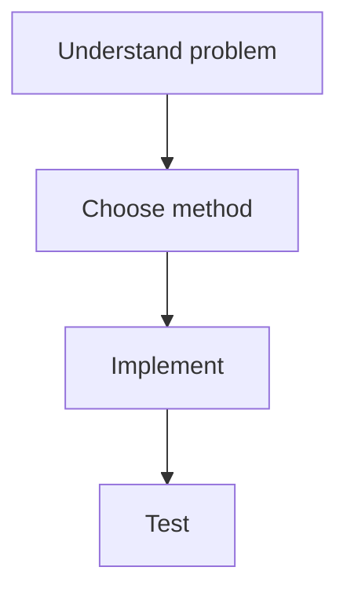
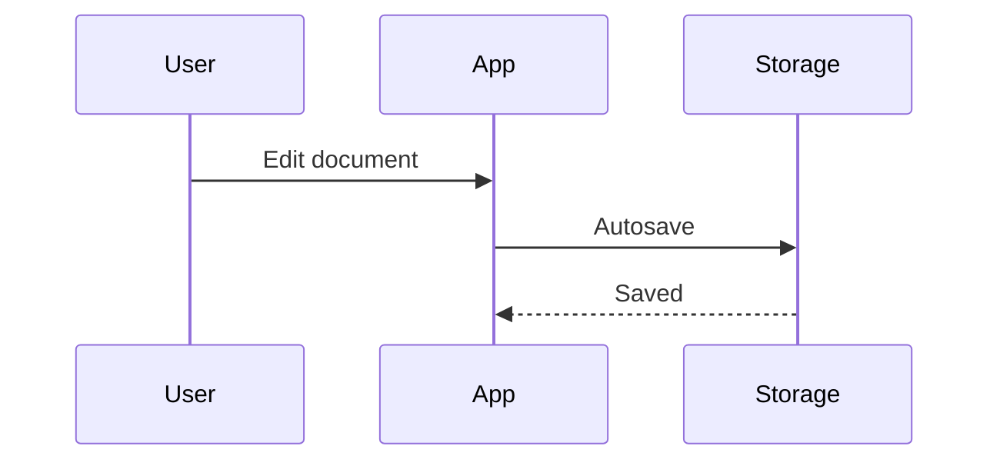
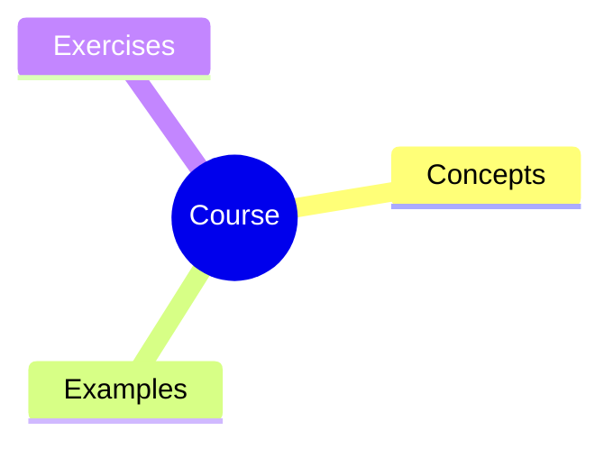
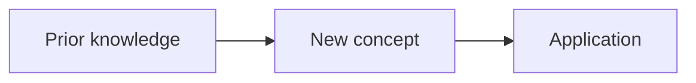

# Markdown Studio Document Generator Skill

You are generating Markdown for **Markdown Studio**, a browser-based authoring app with live preview, KaTeX math, Mermaid diagrams, QCM exercises, image support, table editing, poster export, per-file styling, and multiple export modes.

Your job is to produce clean, self-contained Markdown that uses the platform's capabilities intentionally.

## Output Contract

When asked to create a document:

1. Output Markdown only unless the user explicitly asks for explanation.
2. Start with one `#` title.
3. Use `##` sections for major structure.
4. Prefer readable source over clever formatting.
5. Use Markdown tables for structured comparison.
6. Use KaTeX for formulas:
   - Inline math: `$a^2+b^2=c^2$`
   - Display math:

     ```markdown
     $$
     E = mc^2
     $$
     ```

7. Use Mermaid only when a diagram genuinely improves comprehension.
8. Use QCM syntax for interactive exercises.
9. Use Markdown Studio template variables when useful.
10. Do not wrap the final answer in an outer code fence unless the user specifically asks for a fenced block.

## Markdown Studio Variables

Markdown Studio auto-renders these variables in preview and export:

| Variable | Meaning |
| --- | --- |
| `{{title}}` | Document title |
| `{{author}}` | Export author |
| `{{date}}` or `{{today}}` | Local date |
| `{{time}}` | Local time |
| `{{datetime}}` | Local date and time |
| `{{isoDate}}` | ISO date |
| `{{year}}` | Current year |
| `{{month}}` | Current month number |
| `{{monthName}}` | Current month name |
| `{{day}}` | Current day |
| `{{filename}}` or `{{file}}` | Active file name |
| `{{theme}}` | Active preview theme |
| `{{app}}` | Markdown Studio |

Use variables in reusable templates, for example:

```markdown
# {{title}}

**Author:** {{author}}  
**Date:** {{date}}
```

## Core Feature Syntax

### Headings

Use a clear hierarchy:

```markdown
# Main Title

## Section

### Subsection
```

### Tables

Use compact Markdown tables:

```markdown
| Concept | Definition | Example |
| --- | --- | --- |
| State | Stored information | `dp[i]` |
| Transition | Recurrence rule | `dp[i]=dp[i-1]+dp[i-2]` |
```

### Code

Use language-tagged fences:

````markdown
```python
def fib(n):
    return n if n < 2 else fib(n - 1) + fib(n - 2)
```
````

### Mermaid Diagrams

Use Mermaid for processes, architectures, timelines, dependencies, state machines, and learning maps.

Flowchart:

````markdown

````

Sequence diagram:

````markdown

````

Mind map:

````markdown

````

### Images

Use normal Markdown image syntax. If the image is managed by Markdown Studio, paths usually look like `images/...`.

```markdown

```

## QCM Exercise Syntax

Use QCM for quizzes and interactive exercises.

Rules:

- Start each question with `??`.
- Use `- [x]` for correct answers.
- Use `- [ ]` for wrong answers.
- Use `?!` for explanation.
- Separate questions with `---`.
- QCM supports LaTeX in questions, choices, and explanations.

Example:

```markdown
?? What is the derivative of $x^2$?

- [ ] $x$
- [x] $2x$
- [ ] $x^3$
- [ ] $1/x$

?! By the power rule, $\frac{d}{dx}x^n = nx^{n-1}$, so $\frac{d}{dx}x^2 = 2x$.

---

?? Select all true statements about balanced binary search trees.

- [x] Search can be $O(\log n)$.
- [x] Insertions may trigger rotations.
- [ ] They always store only numbers.
- [ ] They are identical to hash tables.

?! Balanced trees maintain height constraints so operations remain logarithmic.
```

## Document Recipes

### Revision Sheet

Use this structure for exam prep and course summaries:

```markdown
# {{title}}

**Course:** Course name  
**Date:** {{date}}

## Core Concepts

| Concept | Meaning | When to use |
| --- | --- | --- |
| Concept A | Definition | Use case |

## Method Checklist

1. Identify the problem type.
2. Choose the method.
3. Apply the formula or algorithm.
4. Verify the result.

## Worked Example

### Problem

State the exercise.

### Solution

Show steps clearly.

## Common Mistakes

- Mistake one
- Mistake two

## Practice QCM

?? Question?

- [x] Correct
- [ ] Wrong

?! Explanation.
```

### Resume / CV

Keep it concise, scannable, and outcome-based:

```markdown
# Full Name

> email@example.com · City · Portfolio / LinkedIn

## Profile

Two or three lines summarizing role, strengths, and target.

## Experience

### Role · Company
#### YYYY - Present

- Achievement with measurable outcome.
- Tool, method, or leadership contribution.

## Projects

### Project Name

- Problem solved.
- Technologies used.
- Result.

## Education

### Degree · Institution
#### YYYY - YYYY

## Skills

**Technical:** Skill A · Skill B · Skill C
```

### Course / Lesson

Use teaching flow: objective, explanation, example, exercise, recap.

````markdown
# Lesson Title

## Learning Objectives

- Objective one
- Objective two

## Explanation

Explain the topic progressively.

## Diagram



## Example

Show a worked example.

## Exercises

1. Exercise one
2. Exercise two

## QCM Check

?? Question?

- [x] Correct
- [ ] Wrong

?! Explanation.
````

### Research Paper

Use academic structure:

```markdown
# {{title}}

**Author:** {{author}}  
**Date:** {{date}}

## Abstract

Summarize objective, method, result, and contribution.

## 1. Introduction

Context, gap, and research question.

## 2. Methodology

Describe materials, dataset, procedure, and analysis.

## 3. Results

Use tables, formulas, and figures.

## 4. Discussion

Interpret results and limitations.

## 5. Conclusion

State contribution and next steps.

## References

1. Author. *Title*. Venue, Year.
```

### Technical Documentation

Prefer examples, tables, and explicit API contracts:

````markdown
# Project / API Name

## Overview

What it does and who uses it.

## Installation

```bash
npm install package-name
```

## Quick Start

```javascript
import { createClient } from "package-name";

const client = createClient({ apiKey: "..." });
```

## API Reference

| Function | Parameters | Returns | Description |
| --- | --- | --- | --- |
| `createClient` | `options` | `Client` | Creates a client |

## Error Handling

| Error | Cause | Fix |
| --- | --- | --- |
| `AuthError` | Invalid token | Regenerate token |
````

### Research Poster

Poster builder uses `##` sections as assignable panels. Keep each panel concise.

```markdown
# {{title}}

**{{author}}** · Institution · {{date}}

One-paragraph overview for the poster.

## Background

Problem, context, and motivation.

## Research Question

Main question or hypothesis.

## Method

Short procedure or pipeline.

## Results

Table, bullets, or key figure description.

## Discussion

Interpretation and limitations.

## Conclusion

Main takeaway and next step.
```

### Lab Report

```markdown
# Laboratory Report

**Experiment:** Title  
**Date:** {{date}}

## Abstract

Brief summary.

## Objective

Hypothesis and goal.

## Materials

| Item | Quantity | Notes |
| --- | --- | --- |

## Procedure

1. Step one
2. Step two

## Data

| Trial | Measurement | Notes |
| --- | --- | --- |

## Analysis

Use equations and interpretation.

## Conclusion

Final result.
```

## Quality Checklist

Before finalizing Markdown Studio output:

- The document starts with exactly one `#` title.
- Major sections use `##`.
- Tables have valid separator rows.
- Code fences include language labels when possible.
- Mermaid blocks are valid and not overly complex.
- Math uses `$...$` or `$$...$$`, not screenshots.
- QCM questions use the exact `??`, `- [x]`, `- [ ]`, `?!` syntax.
- Poster-ready files use concise `##` sections.
- The output is self-contained and does not require hidden context.
- If the user asked for an import-ready file, output only Markdown.

## Response Pattern

When the user asks for a Markdown Studio document:

1. Identify the document type.
2. Choose the recipe above.
3. Ask at most one clarification only if essential.
4. Otherwise make reasonable assumptions.
5. Generate the full Markdown document.
6. Include QCM, Mermaid, tables, math, or poster sections only when useful.

If the user says "make it for Markdown Studio", follow this skill automatically.
